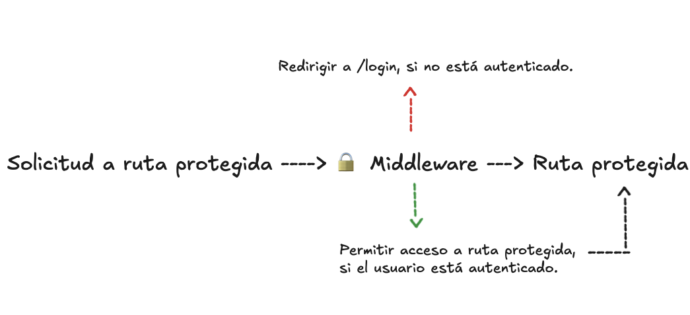

### Middlewares

Los `Middlewares` son funciones que tienen acceso al objeto de request, response y a next.
Generalmente, estos se ejecutan durante el ciclo de  vida de una solicitud HTTP, lo que significa que pueden intervenir en el proceso de una petición antes de que llegue a la ruta final, donde se manejará la respuesta.

Específicamente, para nuestro proyecto, queremos desarrollar un Middleware que nos permitirá proteger las rutas que solo pueden ser accedidas por usuarios autenticados.

